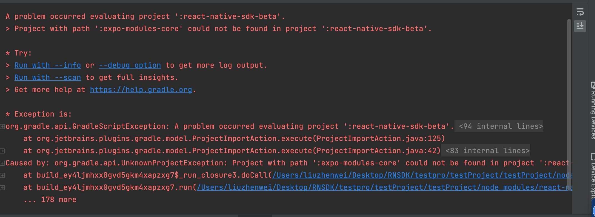

# Portkey React Native SDK

## Installation
__Note: We should use react-native version less than v0.73__

### Step 1: Install npm package

``` shell
npm install @portkey/react-native-sdk --save
# or
yarn add @portkey/react-native-sdk
```

**Step 2: Config** <br>
1. We are using expo-related libraries, so you need to configure the expo autolinking plugin
``` groovy
//in android/settings.gradle file
dependencyResolutionManagement {
    repositoriesMode.set(RepositoriesMode.PREFER_SETTINGS)
    repositories {
        google()
        mavenCentral()
        maven { url "https://jitpack.io" }
        // add this maven path for expo-camera dependencies
        maven {
            url "../node_modules/expo-camera/android/maven"
        }
    }
}

// add the follow code for autolink
apply from: new File(["node", "--print", "require.resolve('expo/package.json')"].execute(null, rootDir).text.trim(), "../scripts/autolinking.gradle");
useExpoModules()
```

``` podspec
# in iOS Podfile, add the follow code

platform :ios, '13.0'

require File.join(File.dirname(`node --print "require.resolve('expo/package.json')"`), "scripts/autolinking")

use_expo_modules!
post_integrate do |installer|
  begin
    expo_patch_react_imports!(installer)
  rescue => e
    Pod::UI.warn e
  end
end
```

2. Create .env file

In order to use Google login, You need to create an **.env** file in the same directory as **package.json**, which must contain **GOOGLE_WEB_CLIENT_ID**, **GOOGLE_IOS_CLIENT_ID** and **GOOGLE_ANDROID_CLIENT_ID**. See [Configure Google Login For Portkey SDK](docs/google-login.md) for details.

``` properties
# .env file like this
GOOGLE_WEB_CLIENT_ID = "your google web client id"
GOOGLE_IOS_CLIENT_ID = "your google ios client id"
GOOGLE_ANDROID_CLIENT_ID = "your google android client id"
```

3. extends tsconfig.json

In your tsconfig.json, add  "extends" key-value.

``` JSON
{
  "extends": "@portkey/react-native-sdk/tsconfig.json",
  "compilerOptions": {
    ...
  }
}
```

if you already extends other tsconfig.json, you can config like this:

``` JSON
{
  "compilerOptions": {
      // add this code
      "types": ["reflect-metadata"],
      "experimentalDecorators": true,
      "emitDecoratorMetadata": true,
  }

}
```

### Step 3: Init

``` TS
// Please import the following statement in your entry file
import '@portkey/react-native-sdk';
```

> Note: We use autolink, you don't need to configure Android/IOS dependencies. But you need to recompile your Android/IOS project so that the autolink takes effect.

Now, all configuration is complete and you can use the portkey service freely.

## API Usage

``` TS
import { portkey } from '@portkey/react-native-sdk';
// get walletInfo
const walletInfo = await portkey.getWalletInfo();
// open assets dashboard
portkey.openAssetsDashboard();
```

## Function Introduction

``` TS
import { portkey } from '@portkey/react-native-sdk';

// Open login page and return UnlockedWallet object after login
function login(): Promise<UnlockedWallet | undefined>;

// Open assets dashboard
function openAssetsDashboard();

// Open guardians manager page
function guardiansManager();

// Open settings manager page
function settingsManager();

// Open Scan QRCode page
function scanQRCodeManager();

// Open payment security manager page
function paymentSecurityManager();

// Unlock wallet and return UnlockedWallet object
function unlockWallet(): Promise<UnlockedWallet | undefined>;

// Call contract method
function callCaContractMethod(props: CallCaMethodProps): Promise<BaseMethodResult>;

// Get wallet info
function getWalletInfo(): Promise<UnlockedWallet>;

// Get wallet state
function getWalletState(): Promise<WalletState>();

// Lock wallet
function lockWallet(): Promise<boolean>();

// Exit wallet
function exitWallet(): Promise<boolean>();
```

 Feel free to open an issue or contact us if you have any questions.

## Q&A
Q: Why does Google login always prompt "login fail"?<br>
A: Make sure the applicationId, keystore, .env file correspond correctly<br><br>
Q:  <br>
A: make sure you have set the expo autolink config in android/settings.gradle file.
